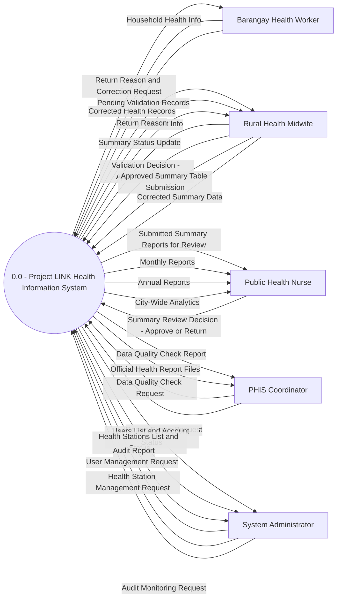

# Context Level DFD (Level 0)

```mermaid
flowchart LR
SYS(("0.0 - Project LINK Health Information System"))
BHW["Barangay Health Worker"]
RHM["Rural Health Midwife"]
PHN["Public Health Nurse"]
PHIS["PHIS Coordinator"]
SA["System Administrator"]

BHW -->|"Household Health Info"| SYS
BHW -->|"Corrected Health Records"| SYS
SYS -->|"Return Reason and Correction Request"| BHW

RHM -->|"Patient Info"| SYS
SYS -->|"Pending Validation Records"| RHM
RHM -->|"Validation Decision - Approve or Return"| SYS
RHM -->|"Approved Summary Table Submission"| SYS
RHM -->|"Corrected Summary Data"| SYS
SYS -->|"Return Reason"| RHM
SYS -->|"Summary Status Update"| RHM

SYS -->|"Submitted Summary Reports for Review"| PHN
PHN -->|"Summary Review Decision - Approve or Return"| SYS
SYS -->|"Monthly Reports"| PHN
SYS -->|"Annual Reports"| PHN
SYS -->|"City-Wide Analytics"| PHN

PHIS -->|"Data Quality Check Request"| SYS
PHIS -->|"Report Export Request"| SYS
SYS -->|"Data Quality Check Report"| PHIS
SYS -->|"Official Health Report Files"| PHIS

SA -->|"User Management Request"| SYS
SA -->|"Health Station Management Request"| SYS
SA -->|"Audit Monitoring Request"| SYS
SYS -->|"Users List and Account Status"| SA
SYS -->|"Health Stations List and Status"| SA
SYS -->|"Audit Report"| SA
```