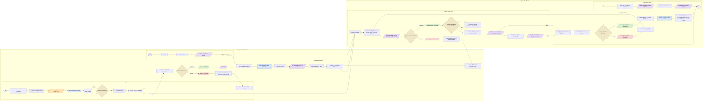

# Digital FHSIS Reporting Flowchart (Mermaid)

```mermaid
flowchart LR
  %% ============================
  %% Swimlanes
  %% ============================

  subgraph BHS["Barangay Health Station"]
    direction LR

    subgraph BHW["Barangay Health Worker"]
      direction TB
      bhw_start([Start]) --> bhw_offline[Offline Field Health Operations]
      bhw_offline --> bhw_h2h[House-to-House Profiling]
      bhw_h2h --> bhw_capture[/Record Response via Mobile PWA/]
      bhw_capture --> bhw_profiles[[Digital Household Profiles]]
      bhw_profiles --> bhw_local[(Local Storage)]
      bhw_local --> bhw_internet{Connected to Internet?}
      bhw_internet -->|No| bhw_local
      bhw_internet -->|Yes| bhw_sync[Background Sync]
      bhw_sync --> bhw_pending[/Record: Pending Validation/]
      bhw_pending --> A1((A))

      bhw_fix[Correct and Resubmit Record] --> bhw_pending
    end

    subgraph RHM["Rural Health Midwife"]
      direction TB
      rhm_view[View Pending BHW Submissions] --> rhm_validate{Validate Submissions}

      rhm_validate -->|Return| rhm_return[/Record: Returned/]
      rhm_return --> rhm_reason_bhw[Return Reason Sent to Barangay Health Worker]
      rhm_reason_bhw --> bhw_fix

      rhm_validate -->|Approve| rhm_validated[/Record: Validated/]
      rhm_validated --> rhm_master[/Masterlist/]
      rhm_master --> rhm_targets_auto[Auto Generate Target Lists]
      rhm_targets_auto --> rhm_target_lists[[Auto Generated Target Client Lists]]
      rhm_target_lists --> rhm_agg[Auto Aggregation]
      rhm_agg --> rhm_summary_auto[/Auto Generated Summary Table/]
      rhm_summary_auto --> rhm_approve[Approve Summary Table]
      rhm_approve --> rhm_submit[Submit to City Health Office II]

      rhm_correct[Correct Returned Summary Table] --> rhm_submit
    end

    subgraph PAT["Patient"]
      direction TB
      pat_start([Start]) --> pat_visits[Visits]
      pat_visits --> pat_register[Register Patient]
      pat_register --> pat_itr[/Individual Treatment Record/]
      pat_itr --> A2((A))
    end
  end

  subgraph CHO2["City Health Office II"]
    direction LR

    subgraph PHN["Public Health Nurse"]
      direction TB
      phn_dash[Nurse Dashboard]
      phn_dash --> phn_review[Review Pending Barangay Health Station Submitted Reports]
      phn_review --> phn_tables[/Summary Tables from all Barangay Health Stations/]
      phn_tables --> phn_approve_tbl{Approve Summary Table?}

      phn_approve_tbl -->|Return| phn_tbl_return[/Summary Table: Returned/]
      phn_tbl_return --> phn_reason_midwife[Return Reason Sent to Barangay Midwife]
      phn_reason_midwife --> rhm_correct

      phn_approve_tbl -->|Approve| phn_tbl_approved[/Summary Table: Approved/]
      phn_tbl_approved --> phn_all_ok{All Summary Tables Approved?}
      phn_all_ok -->|Yes| phn_consolidate[Auto-Consolidate Approved Summary Tables]
      phn_all_ok -->|No| phn_wait[Wait for remaining Summary Table Approvals]
      phn_wait --> phn_all_ok

      phn_consolidate --> phn_monthly[/Auto-Generated Monthly Consolidation Table/]
      phn_monthly --> phn_analytics[City-Wide Analytics Dashboard]
      phn_analytics --> phn_annual[/Auto-Generated Annual City-Wide Reports/]
      phn_monthly --> B1((B))
      phn_annual --> B2((B))
    end

    subgraph PHIS["PHIS Coordinator"]
      direction TB
      phis_dash[Data Quality Check Review Dashboard]
      phis_dash --> phis_start[Start Auto-Data Quality Check]
      phis_start --> phis_gate{Data Quality Check Passed?}

      phis_gate -->|No| phis_return[/Data Quality Check: Returned/]
      phis_return --> phis_discrepancy[Send Discrepancy Report for Correction]
      phis_discrepancy --> phn_review

      phis_gate -->|Yes| phis_approved[/Data Quality Check: Approved/]
      phis_approved --> phis_export[Export Reports in Excel or PDF Format]
      phis_export --> phis_reports[[Reports in Excel or PDF Format]]
      phis_reports --> phis_submit[Submit Reports to Provincial Health Office via same DOH Excel-Based E-Tools]
    end

    subgraph CHO["City Health Officer"]
      direction TB
      cho_start((A)) --> cho_surveillance[Real-Time Surveillance Dashboard]
      cho_surveillance --> cho_realtime[/Real-Time Health Records with Status/]
      cho_realtime --> cho_map[Map Records and Cases]
      cho_map --> cho_gis[/GIS Map and Predictive Analytics/]
      cho_gis --> cho_end([End])
    end
  end

  %% ============================
  %% Cross-lane connectors and handoffs
  %% ============================

  A1 --> rhm_view
  A1 --> phn_dash
  A2 --> phn_dash
  A2 --> rhm_targets_auto

  rhm_submit --> phn_dash

  B1 --> phis_dash
  B2 --> phis_dash

  phis_submit --> cho_end

  %% ============================
  %% Optional visual classes (to mimic original color semantics)
  %% ============================

  classDef decision fill:#efe7c6,stroke:#9a7a25,color:#222;
  classDef statusReturn fill:#f7d3d3,stroke:#c55f5f,color:#222;
  classDef statusApprove fill:#d7efcf,stroke:#67a65e,color:#222;
  classDef generated fill:#d9e6ff,stroke:#5f8dd8,color:#222;
  classDef table fill:#e7d9f7,stroke:#8b6bb8,color:#222;
  classDef input fill:#ffe3b5,stroke:#c98a1f,color:#222;

  class rhm_validate,phn_approve_tbl,phn_all_ok,bhw_internet,phis_gate decision;
  class rhm_return,phn_tbl_return,phis_return statusReturn;
  class rhm_validated,phn_tbl_approved,phis_approved statusApprove;
  class bhw_profiles,rhm_target_lists,phis_reports generated;
  class rhm_master,rhm_summary_auto,pat_itr,phn_tables,phn_monthly,phn_annual,cho_realtime,cho_gis table;
  class bhw_capture input;
```
