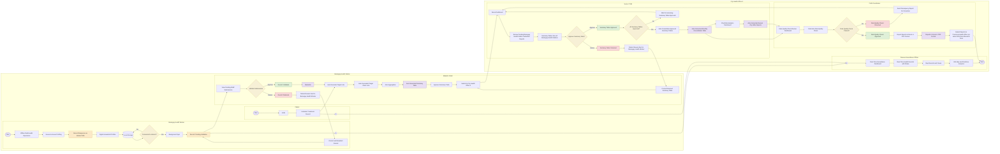

# Proposed Swimlane Flow (Mermaid)

```mermaid
flowchart LR
    subgraph BHS["Barangay Health Station"]
        direction LR

        subgraph BHW["Barangay Health Worker"]
            direction TB
            bhw_start([Start]) --> bhw_offline[Offline Field Health Operations]
            bhw_offline --> bhw_profile[House-to-House Profiling]
            bhw_profile --> bhw_pwa[Record Response via Mobile PWA]
            bhw_pwa --> bhw_digital[Digital Household Profiles]
            bhw_digital --> bhw_storage[(Local Storage)]
            bhw_storage --> bhw_net{Connected to Internet?}
            bhw_net -- No --> bhw_storage
            bhw_net -- Yes --> bhw_sync[Background Sync]
            bhw_sync --> bhw_pending[Record: Pending Validation]
            bhw_pending --> bhw_a((A))
            bhw_correct[Correct and Resubmit Record] --> bhw_pending
        end

        subgraph BHS_MIDWIFE["Midwife / RHM"]
            direction TB
            bhs_view[View Pending BHW Submissions] --> bhs_validate{Validate Submissions}
            bhs_validate -- Return --> bhs_returned[Record: Returned]
            bhs_returned --> bhs_reason[Return Reason Sent to Barangay Health Worker]
            bhs_validate -- Approve --> bhs_validated[Record: Validated]
            bhs_validated --> bhs_masterlist[Masterlist]
            bhs_masterlist --> bhs_target[Auto Generate Target Lists]
            bhs_target --> bhs_generated_targets[Auto Generated Target Client Lists]
            bhs_generated_targets --> bhs_agg[Auto Aggregation]
            bhs_agg --> bhs_summary[Auto Generated Summary Table]
            bhs_summary --> bhs_approve_summary[Approve Summary Table]
            bhs_approve_summary --> bhs_submit[Submit to City Health Office II]
            bhs_correct_summary[Correct Returned Summary Table] --> bhs_submit
        end

        subgraph PATIENT["Patient"]
            direction TB
            patient_start([Start]) --> patient_visits[Visits]
            patient_visits --> patient_itr[Individual Treatment Record]
            patient_itr --> patient_a((A))
        end
    end

    subgraph CHO["City Health Office II"]
        direction LR

        subgraph NURSE["Nurse / PHN"]
            direction TB
            nurse_dash[Nurse Dashboard] --> nurse_review[Review Pending Barangay Health Station Submitted Reports]
            nurse_review --> nurse_tables[Summary Tables from all Barangay Health Stations]
            nurse_tables --> nurse_approve{Approve Summary Table?}
            nurse_approve -- Return --> nurse_returned[Summary Table: Returned]
            nurse_returned --> nurse_reason[Return Reason Sent to Barangay Health Worker]
            nurse_approve -- Approve --> nurse_approved[Summary Table: Approved]
            nurse_approved --> nurse_all{All Summary Tables Approved?}
            nurse_all -- Yes --> nurse_consolidate[Auto-Consolidate Approved Summary Tables]
            nurse_all -- No --> nurse_wait[Wait for remaining Summary Table Approvals]
            nurse_wait --> nurse_dash
            nurse_consolidate --> nurse_monthly[Auto-Generated Monthly Consolidation Table]
            nurse_monthly --> nurse_analytics[City-Wide Analytics Dashboard]
            nurse_analytics --> nurse_annual[Auto-Generated Annual City-Wide Reports]
        end

        subgraph PHIS_COORDINATOR["PHIS Coordinator"]
            direction TB
            cho_dq_dash[Data Quality Check Review Dashboard] --> cho_dq_start[Start Auto-Data Quality Check]
            cho_dq_start --> cho_dq_passed{Data Quality Check Passed?}
            cho_dq_passed -- No --> cho_dq_returned[Data Quality Check: Returned]
            cho_dq_returned --> cho_discrepancy[Send Discrepancy Report for Correction]
            cho_dq_passed -- Yes --> cho_dq_approved[Data Quality Check: Approved]
            cho_dq_approved --> cho_export[Export Reports in Excel or PDF Format]
            cho_export --> cho_reports[Reports in Excel or PDF Format]
            cho_reports --> cho_submit[Submit Reports to Provincial Health Office via same DOH Excel-Based E-Tools]
        end

        subgraph DSO["Disease Surveillance Officer"]
            direction TB
            dso_a((A)) --> dso_dashboard[Real-Time Surveillance Dashboard]
            dso_dashboard --> dso_realtime[Real-Time Health Records with Status]
            dso_realtime --> dso_map[Map Records and Cases]
            dso_map --> dso_gis[GIS Map and Predictive Analytics]
            dso_gis --> dso_end([End])
        end
    end

    bhw_pending --> bhs_view
    bhs_reason --> bhw_correct
    patient_itr --> bhs_target
    bhs_submit --> nurse_dash
    nurse_reason --> bhs_correct_summary
    nurse_monthly --> cho_dq_dash
    nurse_annual --> cho_dq_dash
    cho_discrepancy --> nurse_dash
    cho_submit --> dso_end
    bhw_a --> dso_a
    patient_a --> dso_a

    classDef decision fill:#f7f0d6,stroke:#c7a13b,stroke-width:1px
    classDef returned fill:#f8d7da,stroke:#c15b62,stroke-width:1px
    classDef approved fill:#dff0d8,stroke:#6ea65d,stroke-width:1px
    classDef generated fill:#e8def4,stroke:#8a6ca8,stroke-width:1px
    classDef sync fill:#fbe9c8,stroke:#d9a441,stroke-width:1px

    class bhw_net,bhs_validate,nurse_approve,nurse_all,cho_dq_passed decision
    class bhs_returned,nurse_returned,cho_dq_returned returned
    class bhs_validated,nurse_approved,cho_dq_approved approved
    class bhs_masterlist,bhs_summary,nurse_monthly,nurse_annual,cho_reports generated
    class bhw_pwa,bhw_pending sync
```
