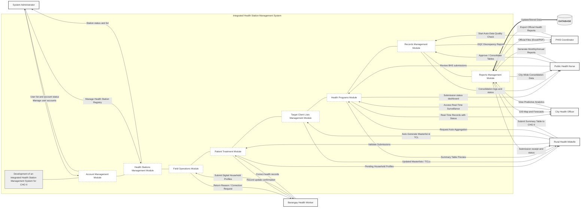

# Theoretical Framework - Project LINK

This diagram visualizes the interactive relationship between system roles and the functional modules of the Integrated Health Station Management System.

```mermaid
flowchart LR
    %% ============================
    %% Roles (Left Side)
    %% ============================
    Admin[System Administrator]
    BHW[Barangay Health Worker]
    PHN[Public Health Nurse]

    %% ============================
    %% Roles (Right Side)
    %% ============================
    CHO[City Health Officer]
    RHM[Rural Health Midwife]
    PHIS[PHIS Coordinator]

    %% ============================
    %% System Modules (Center)
    %% ============================
    subgraph System ["Integrated Health Station Management System"]
        direction TB
        Title[Development of an Integrated Health Station Management System for CHO II]
        
        M1[Account Management Module]
        M2[Health Stations Management Module]
        M3[Field Operations Module]
        M4[Patient Treatment Module]
        M5[Target Client Lists Management Module]
        M6[Health Programs Module]
        M7[Records Management Module]
        M8[Reports Management Module]

        Title --- M1 --- M2 --- M3 --- M4 --- M5 --- M6 --- M7 --- M8
    end

    %% ============================
    %% Connections - Left Side Roles
    %% ============================
    Admin -- "Manage user accounts" --> M1
    M1 -- "User list and account status" --> Admin
    
    Admin -- "Manage Health Station Registry" --> M2
    M2 -- "Station status and list" --> Admin
    
    BHW -- "Submit Digital Household Profiles" --> M3
    M3 -- "Return Reason / Correction Request" --> BHW

    BHW -- "Correct health records" --> M4
    M4 -- "Record update confirmation" --> BHW

    PHN -- "Review BHS submissions" --> M6
    M6 -- "Submission status dashboard" --> PHN

    PHN -- "Approve / Consolidate Tables" --> M7
    M7 -- "Consolidation logs and status" --> PHN

    PHN -- "Generate Monthly/Annual Reports" --> M8
    M8 -- "City-Wide Consolidation Data" --> PHN

    %% ============================
    %% Connections - Right Side Roles
    %% ============================
    CHO -- "Access Real-Time Surveillance" --> M6
    M6 -- "Real-Time Records with Status" --> CHO

    CHO -- "View Predictive Analytics" --> M8
    M8 -- "GIS Map and Forecasts" --> CHO

    RHM -- "Validate Submissions" --> M4
    M4 -- "Pending Household Profiles" --> RHM
    
    RHM -- "Auto-Generate Masterlist & TCL" --> M5
    M5 -- "Updated Masterlists / TCLs" --> RHM
    
    RHM -- "Request Auto-Aggregation" --> M6
    M6 -- "Summary Table Preview" --> RHM
    
    RHM -- "Submit Summary Table to CHO II" --> M8
    M8 -- "Submission receipt and status" --> RHM

    PHIS -- "Start Auto-Data Quality Check" --> M7
    M7 -- "DQC Discrepancy Report" --> PHIS
    
    PHIS -- "Export Official Health Reports" --> M8
    M8 -- "Official Files (Excel/PDF)" --> PHIS

    %% ============================
    %% Database
    %% ============================
    DB[(DATABASE)]
    M8 <== "Update/Stored Data" ==> DB

    %% ============================
    %% Styling
    %% ============================
    classDef role fill:#f9f9f9,stroke:#333,stroke-width:2px;
    classDef module fill:#fff,stroke:#666,stroke-dasharray: 5 5;
    classDef title fill:#eee,stroke:#333,stroke-width:1px;
    classDef database fill:#f2f2f2,stroke:#333,font-weight:bold;

    class Admin,BHW,PHN,CHO,RHM,PHIS role;
    class M1,M2,M3,M4,M5,M6,M7,M8 module;
    class Title title;
    class DB database;
```
