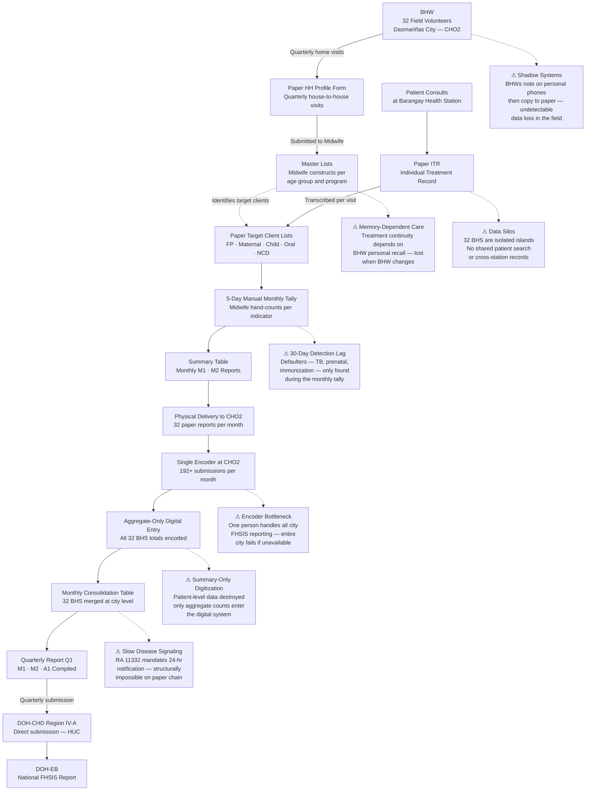

# CHO2 Current Process and Problem Analysis

> **Scope:** City Health Office II (CHO II) — Dasmariñas City, Cavite
> **Coverage:** 32 Barangay Health Stations, 164,691 residents
> **Reference:** Project LINK brainstorm.md, FHSIS MOP 2018

---

## Overview

City Health Office II (CHO2) oversees 32 Barangay Health Stations (BHS) across Dasmariñas City. CHO2 operates under the FHSIS framework mandated by the DOH, but the current implementation is entirely paper-based at the BHS level. All 32 health stations function as isolated data islands with no shared digital infrastructure.

This document captures the **current state** of CHO2 operations before the implementation of Project LINK — including workflows, pain points, and operational failures.

---

## Current Operational State

| Domain | Current State |
|---|---|
| Infrastructure | All 32 BHS operate entirely on paper. Desktops are used only as printers. |
| Patient Records | Paper ITRs filed physically per station. No city-wide patient search. |
| Reporting | Manual tally and physical report delivery to CHO2 monthly. |
| Digital Entry | Only aggregate totals are digitized, at the CHO level, by a single encoder. |
| Disease Surveillance | No real-time alerting. Outbreaks detected via monthly aggregate review. |
| Field Documentation | BHWs use personal phone notepads during visits and copy to paper later. |

---

## Process Flow — CHO2 Specific

### Step 1 — Community / Field Level

**Actors:** 32 BHWs assigned across all barangays

- Each BHW covers approximately 20–25 households in their assigned purok.
- BHWs conduct quarterly household profiling using paper HH Profile Forms.
- During field visits, **BHWs informally record notes on personal mobile phones** before later copying them to the official paper forms at the BHS.
- Master Lists are constructed by the Midwife from compiled HH Profiles and shared back to BHWs as reference for follow-up scheduling.

---

### Step 2 — BHS Recording (Per Patient Visit)

**Actor:** Midwife / Rural Health Midwife (RHM) at each of the 32 BHS

For every patient consultation:

1. Midwife opens the patient's physical **ITR folder** from the filing cabinet.
2. Records the visit — date, vitals, complaint, diagnosis, treatment — on the paper ITR.
3. Transcribes relevant data to the corresponding paper **TCL** for the patient's program cluster (FP, maternal, immunization, TB, NCD, etc.).
4. For chronic or positive disease cases, logs into the relevant paper **Disease Registry** (TB, Filariasis, STH, STI, NCD).

All records remain physically at the BHS. **No data is shared between stations.**

---

### Step 3 — Monthly Manual Tally (End of Month)

**Actor:** Midwife / RHM

At the end of each month, the Midwife manually tallies:

- Each TCL entry for every indicator across all 5 program clusters.
- Entries in Disease Registries for morbidity totals.
- Death and birth records obtained from the Local Civil Registry.

This process takes approximately **4–5 working days** and is performed entirely by hand with a pen and paper tally sheet.

The output is a completed **Summary Table (ST)** — a 12-month running grid with one row per indicator and one column per month.

From the ST, the Midwife prepares:
- **M1** — Monthly Program Accomplishment Report
- **M2** — Monthly Morbidity / Disease Report

---

### Step 4 — Physical Submission to CHO2

**Actor:** Midwife → CHO2 Office

- The completed M1 and M2 paper reports are **physically delivered** to the CHO2 central office.
- This results in **192+ physical report submissions per month** (32 BHS × 6+ forms each).
- Submission deadline: **Monday of the 1st week of the succeeding month**.
- Late submissions or absent couriers directly delay city-wide reporting.

---

### Step 5 — Digital Encoding at CHO2

**Actor:** Single Encoder at CHO2

- A **single designated encoder** at CHO2 manually encodes the data from all 32 BHS reports into a desktop spreadsheet or the DOH-prescribed digital format.
- Only **aggregate totals** (e.g., "45 prenatal check-ups") are entered — individual patient-level data is never digitized.
- This is the **first and only point** at which CHO2 data enters a digital system.

---

### Step 6 — Consolidation and Reporting

**Actor:** Public Health Nurse (PHN) / FHSIS Coordinator at CHO2

- PHN reviews the encoded data and manually constructs the **Monthly Consolidation Table (MCT)** covering all 32 barangays.
- PHN integrates additional data from the Local Civil Registry (births and deaths) and any hospital FP/maternal reports.
- PHN performs manual data quality checks (sum validation, percentage checks).
- From the MCT, PHN prepares:
  - **Q1 Quarterly Report** — submitted to DOH-CHD Region IV-A (Dasmariñas is an HUC; submits directly, bypassing PHO)
  - **A1 Annual Report** — submitted annually

---

### Step 7 — Disease Surveillance (Ad Hoc)

**Actor:** Midwife → PHN → Disease Surveillance Officer (DSO)

- When a notifiable disease case is identified at the BHS, the Midwife completes a paper **Case Investigation Form (CIF)**.
- The CIF is physically delivered or faxed to CHO2.
- CHO2 forwards to the DSO and eventually to DOH-CHD.
- **No real-time alerting mechanism exists.** The entire chain is paper-dependent.

---

## Identified Problems

### P1 — Shadow Systems

> **Source:** `brainstorm.md` §2.1

BHWs record patient service information on **personal mobile phone notepads** during field visits, then manually transcribe the data to official paper forms at a later time. This introduces:
- Transcription errors between mobile notes and paper forms
- Undetectable data loss (no audit trail)
- Inconsistency between what was observed and what is officially recorded

---

### P2 — Memory-Dependent Care

> **Source:** `brainstorm.md` §2.3

Treatment continuity for patients (TB follow-up, prenatal schedules, immunization completion) depends on the **personal memory of individual BHWs** rather than a systemic record. When a BHW is absent, transferred, or replaced, patient follow-up history is lost with them.

---

### P3 — Data Silos

> **Source:** `brainstorm.md` §2.1

Each of the 32 BHS maintains its own isolated set of paper records. There is:
- No shared patient identity across stations
- No mechanism to search patient history city-wide
- Duplicate patient records across stations (patients seen at multiple BHS)
- No visibility into care received at other stations

---

### P4 — 30-Day Detection Lag

> **Source:** `brainstorm.md` §2.1

Missed follow-ups and treatment defaulters (TB missed doses, incomplete prenatal schedule, unvaccinated infants) are only identified **during the monthly manual tally** — at minimum 30 days after the missed appointment. Patients at risk go undetected and uncontacted for the entire period.

---

### P5 — Encoder Bottleneck

> **Source:** `brainstorm.md` §2.1

A **single person** at CHO2 is responsible for encoding M1 and M2 data for all 32 BHS — handling **192+ report submissions per month**. This creates:
- A structural single point of failure for the entire city's FHSIS compliance
- Encoding backlog during absences, leaves, or staff turnover
- No redundancy or backup system

---

### P6 — Summary-Only Digitization

> **Source:** `brainstorm.md` §2.1

Data enters the digital system only at the CHO level as **aggregate counts**. The granular patient-level detail recorded in the ITRs and TCLs is never digitized. Consequently:
- Patient history cannot be retrieved digitally
- Trend analysis is limited to totals, not individual trajectories
- Program-level errors in paper tallying are invisible to supervisors

---

### P7 — Slow Disease Signaling

> **Source:** `brainstorm.md` §2.3

RA 11332 (Mandatory Reporting of Notifiable Diseases) mandates **24-hour notification** for Category I disease cases. The current paper chain — BHS → physical CIF delivery → CHO2 → DSO → DOH-CHD — makes compliance with this timeline **structurally impossible**. Outbreak detection currently relies on monthly aggregate review.

---

## Problem–Process Mapping

| Problem | Affected Process Step | Impact |
|---|---|---|
| Shadow Systems | Step 1 — Field Data Capture | Undetectable data loss at source |
| Memory-Dependent Care | Step 2 — BHS Recording | Lost follow-up history when BHW changes |
| Data Silos | Step 2 — BHS Recording | Duplicate records; no cross-station care |
| 30-Day Detection Lag | Step 3 — Monthly Tally | At-risk patients uncontacted for 30+ days |
| Encoder Bottleneck | Step 5 — Digital Encoding | City-wide reporting halts on 1 person |
| Summary-Only Digitization | Step 5 — Digital Encoding | Patient detail permanently lost |
| Slow Disease Signaling | Step 7 — Surveillance | RA 11332 non-compliance |

---

## Current Process Flowchart

---

## Summary

CHO2 currently serves 164,691 people across 32 BHS using a fully paper-based FHSIS workflow. The absence of digital infrastructure at the BHS level means that patient-level data is never captured in a reusable form — it is collected, tallied, compressed into totals, and discarded. The single encoder at CHO2 is a structural fragility that puts city-wide FHSIS compliance at risk every month. Real-time disease surveillance is impossible under the current setup, leaving CHO2 unable to meet RA 11332 obligations.

These are the conditions that Project LINK is designed to address.
