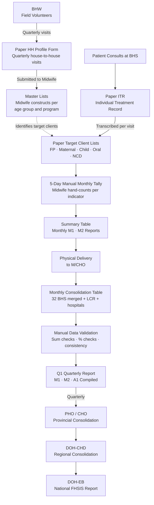

# FHSIS Current (Manual) Process

> **Reference:** FHSIS Manual of Operations 2018 — DOH Department Memorandum 2024-0007
> **Scope:** Barangay Health Station (BHS) → Municipal/City Health Office → Provincial/City Health Office → DOH-CHD → DOH-EB

---

## Overview

The Field Health Services Information System (FHSIS) is the DOH's nationwide, facility-based public health data collection system. It governs how Barangay Health Stations (BHS), Rural Health Units (RHU), and Main Health Centers (MHC) record, consolidate, and report health service coverage data upward through six administrative tiers — from the barangay to the DOH Central Office.

All data collection, recording, and consolidation in the current system is **entirely paper-based** at the BHS level. Digital entry only occurs at the city/municipal health office level — and only as aggregate totals.

---

## Administrative Tiers

| Level | Facility / Office | Key Staff |
|---|---|---|
| 1 | Barangay / Community | BHW, Volunteer Workers |
| 2 | Barangay Health Station (BHS) | Midwife / RHM |
| 3 | Municipal / City Health Office (M/CHO) | PHN, FHSIS Coordinator |
| 4 | Provincial / City Health Office (PHO/CHO) | Provincial/City FHSIS Coordinator |
| 5 | DOH Center for Health Development (DOH-CHD) | Regional FHSIS Coordinator |
| 6 | DOH Epidemiology Bureau (DOH-EB) | National FHSIS Coordinator |

---

## Process Flow

### Step 1 — Household Profiling (Community Level)

**Actor:** BHW / Volunteer Worker

- BHW conducts house-to-house visits within their assigned catchment (~20–25 households per BHW).
- Fills out the **HH Profile Form** for every household member, recording:
  - Name, sex, age, birthday
  - Age/health-risk classification codes (N, I, U, S, A, P, WRA, PP, SC, AB, PWD)
  - NHTS/4Ps status, PhilHealth membership
- Completed forms are submitted to the supervising Midwife by the **3rd week of January** and updated every quarter.

**Output:** Accomplished HH Profile Forms submitted to BHS Midwife.

---

### Step 2 — Master List Construction (BHS Level)

**Actor:** Midwife / RHM

- Midwife compiles all HH Profile Forms from BHWs.
- Constructs and maintains **9 Master Lists** of targeted client groups:
  1. Women of Reproductive Age (FP)
  2. Pregnant and Postpartum Women (Pregnancy Tracking Form)
  3. Newborns, Infants, Under-5, SAC, Adolescents
  4. Oral Health Clients
  5. Adults 20–59 years old (NCD)
  6. Senior Citizens ≥60
  7. Households on Environmental Health and Sanitation
  8. Industrial Establishments with Sanitary Permits
  9. Barangays by ZOD Certification Status

**Output:** Paper Master Lists per target group, used to populate TCLs.

---

### Step 3 — Clinical Recording at BHS (Per Patient Visit)

**Actor:** Midwife / RHM

#### 3a. Individual Treatment Record (ITR)
- For every patient consultation, the Midwife records in a paper **ITR**:
  - Date, name, address, complaint, diagnosis, treatment
  - Results of screenings and referrals
- Program-specific ITR variants exist for: FP (Form 1), Maternal Care, Dental (Form 1), PhilPEN NCD, TB (via ITIS), Malaria (via PhilMIS), Filariasis, STH, STI, Leprosy, Rabies.
- ITRs are filed physically per patient for retrieval on follow-up visits.

#### 3b. Target Client Lists (TCL)
- The Midwife transcribes client visit data from ITRs into **5 paper TCLs**:
  1. TCL for Family Planning Services
  2. TCL for Maternal Care Services
  3. TCL for Child Care and Services (5 sub-parts)
  4. TCL for Oral Health Care and Services
  5. TCL for NCD Prevention and Control (3 sub-parts)
- TCLs track services delivered per individual and flag those who have not yet been served.

#### 3c. Disease Registries
- Positive/chronic cases are enrolled in program-specific **Registries**:
  - TB Registry (managed via ITIS)
  - Malaria Registry (managed via PhilMIS)
  - Filariasis, STH, STI, Leprosy, Rabies Registries
  - NCD / Lifestyle-Related Disease Registry

**Output:** Filled ITRs filed by patient; updated TCLs per program; Registry entries for chronic cases.

---

### Step 4 — Monthly Manual Tally (BHS Level)

**Actor:** Midwife / RHM

- At end of each month, the Midwife manually tallies all TCL entries indicator-by-indicator.
- This process typically takes **4–5 working days**.
- Tallied data is entered into **2 Summary Tables (ST)**:
  1. ST on Program Accomplishment / Service Coverage (12-month running column format)
  2. ST on Mortality and Natality

**Output:** Completed Summary Tables serving as the BHS-level monthly record.

---

### Step 5 — Monthly Report Preparation (BHS Level)

**Actor:** Midwife / RHM

From the completed Summary Tables, the Midwife prepares:

| Report | Description | Submission Deadline |
|---|---|---|
| **M1** | Monthly Program Accomplishment / Service Coverage | Monday, 1st week of succeeding month |
| **M2** | Monthly Morbidity and Disease Report (by type, sex, age group) | Monday, 1st week of succeeding month |
| **Annual Form A-Barangay** | Nutrition, deworming, infectious disease, demographic | Wednesday, 1st week of January |

**Output:** Physical paper M1 and M2 reports delivered manually to the M/CHO.

---

### Step 6 — Consolidation at M/CHO (City Level)

**Actor:** Public Health Nurse (PHN) / FHSIS Coordinator

- PHN receives M1 and M2 reports from all BHSs and integrates:
  - **Local Civil Registry (LCR)** data: live births and mortality
  - **Hospital and private clinic** data (FP, maternal, immunization, TB)
  - **School and Day Care Center** MDA and immunization data
- Consolidates all data into the **Monthly Consolidation Table (MCT)**, listing every indicator by barangay.
- Performs **manual data validation**:
  - Subtotals and grand totals must match
  - Percentages must not exceed 100% of eligible population
  - Cross-dataset consistency (same denominator used across related indicators)
  - Zero vs. missing vs. N/A distinction

From the validated MCT, the PHN prepares:

| Report | Description | Submission Deadline |
|---|---|---|
| **M2 Consolidated** | City-wide morbidity report | Friday, 1st week of succeeding month |
| **Q1** | Quarterly Program Accomplishment Report (coverage + deaths + natality) | Wednesday, 2nd week, 1st month of succeeding quarter |
| **A1** | Annual Report (nutrition, deworming, malaria, demographic) | Wednesday, 2nd week of January |

**Output:** M2 (monthly), Q1 (quarterly), A1 (annual) submitted to PHO/CHO.

---

### Step 7 — Provincial / City Health Office (PHO/CHO Level)

**Actor:** Provincial/City FHSIS Coordinator

- Receives Q1, M2, and A1 from all M/CHOs in the province.
- Validates and consolidates into provincial/city-level reports.
- Submission schedule:

| Report | Deadline |
|---|---|
| M1 Monthly | Wednesday, 2nd week of succeeding month |
| Q1 Quarterly | Monday, 3rd week, 1st month of succeeding quarter |
| A1 Annual | Monday, 3rd week of January |

> **Note for Highly Urbanized Cities (HUC) like Dasmariñas:** Q1 and A1 reports are submitted **directly to DOH-CHD**, bypassing the PHO level.

---

### Step 8 — Regional Level (DOH-CHD)

**Actor:** Regional FHSIS Coordinator

- Consolidates reports from all PHOs/CHOs in the region.
- Validates data quality and produces regional FHSIS reports.
- Submission to DOH-EB:

| Report | Deadline |
|---|---|
| M1 Monthly | Monday, 3rd week of succeeding month |
| Q1 Quarterly | Last working day, 1st month of succeeding quarter |
| A1 Annual | Last working day of January |

---

### Step 9 — National Level (DOH-EB)

**Actor:** National FHSIS Coordinator (DOH Epidemiology Bureau)

- Consolidates all regional reports into the **National FHSIS Annual Report**.
- Report is disseminated to DOH program managers, policy makers, and LGUs.
- Used for budget allocation, program planning, and SDG/PHA performance tracking.

---

## Summary of Recording and Reporting Forms

| Form | Type | Managed By | Level |
|---|---|---|---|
| HH Profile Form | Profiling | BHW | Community |
| Individual Treatment Record (ITR) | Recording | Midwife | BHS |
| Target Client Lists — 5 TCLs | Recording | Midwife | BHS |
| Disease Registries (TB, Malaria, STH, etc.) | Recording | Midwife / Program Coordinator | BHS |
| Summary Table (ST) | Consolidation | Midwife | BHS |
| Monthly Consolidation Table (MCT) | Consolidation | PHN / FHSIS Coordinator | M/CHO |
| M1 — Monthly Program Accomplishment | Reporting | Midwife → PHN | BHS → M/CHO |
| M2 — Monthly Morbidity Report | Reporting | Midwife → PHN | BHS → M/CHO |
| Q1 — Quarterly Report | Reporting | PHN / FHSIS Coordinator | M/CHO → PHO/CHO |
| A1 — Annual Report | Reporting | PHN / FHSIS Coordinator | M/CHO → PHO/CHO |

---

## Current Process Flowchart

